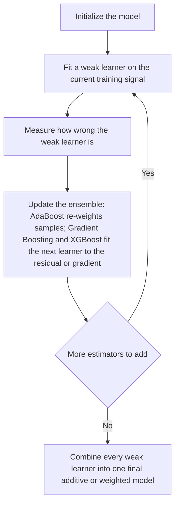
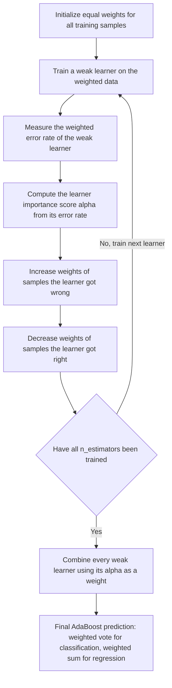
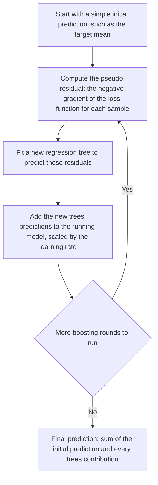
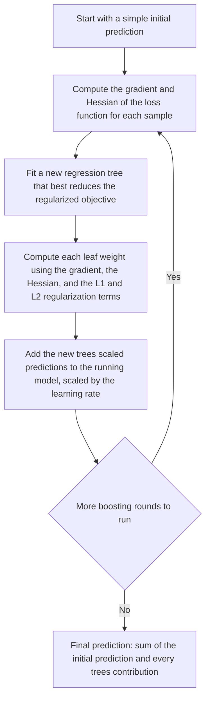
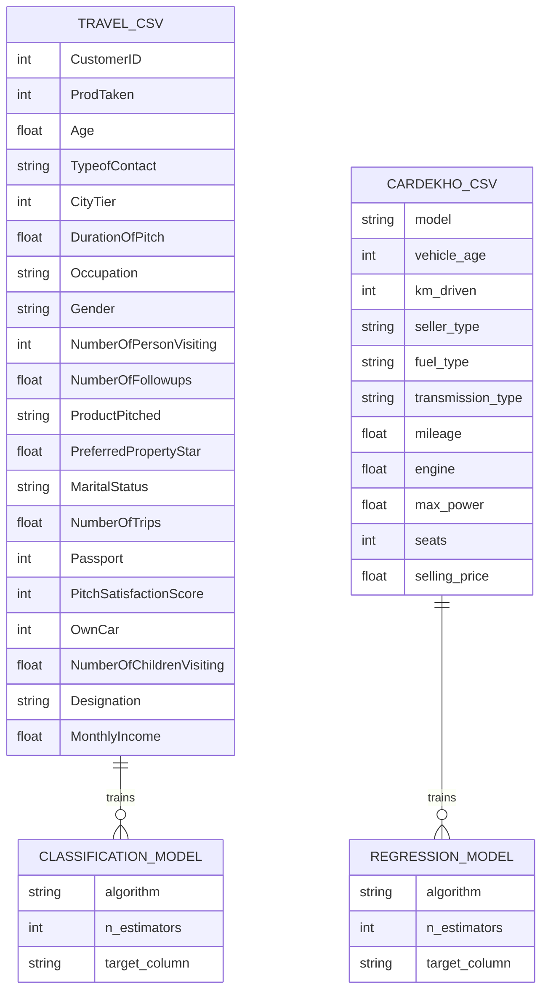
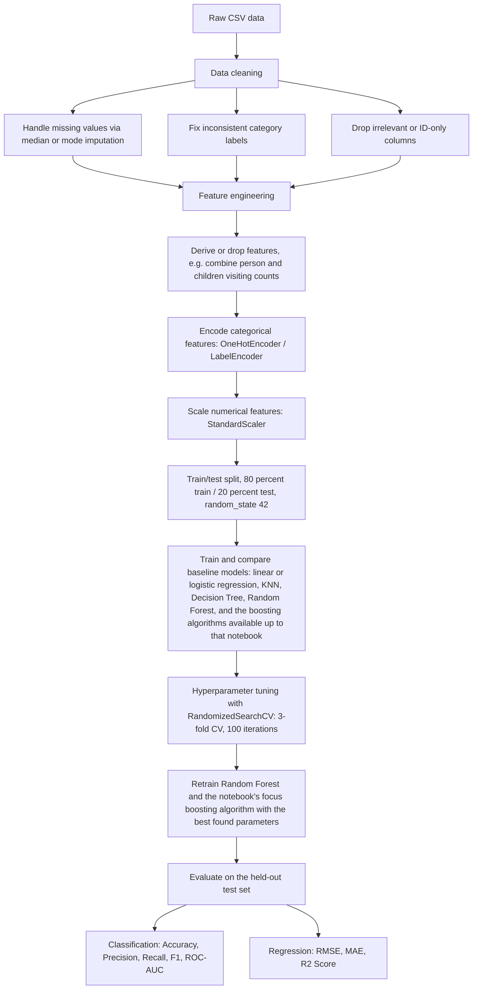

# Ensemble Learning Projects

**Classification and Regression using three boosting algorithms — AdaBoost, Gradient Boosting, and XGBoost — applied to two real-world business problems: holiday package purchase prediction and used car price prediction.**


---

## Table of Contents

- [Overview](#overview)
- [Ensemble Learning Foundations](#ensemble-learning-foundations)
  - [Bagging vs Boosting](#bagging-vs-boosting)
  - [The General Boosting Loop](#the-general-boosting-loop)
- [Boosting Algorithms Covered in This Project](#boosting-algorithms-covered-in-this-project)
  - [AdaBoost](#adaboost)
  - [Gradient Boosting](#gradient-boosting)
  - [XGBoost](#xgboost)
  - [Algorithm Comparison](#algorithm-comparison)
- [Repository Structure](#repository-structure)
- [Datasets](#datasets)
  - [Travel Dataset — Holiday Package Purchase Prediction](#travel-dataset--holiday-package-purchase-prediction)
  - [Cardekho Dataset — Used Car Price Prediction](#cardekho-dataset--used-car-price-prediction)
- [Project Workflow](#project-workflow)
- [Notebook Breakdown](#notebook-breakdown)
  - [Classification Notebooks](#classification-notebooks)
  - [Regression Notebooks](#regression-notebooks)
- [Results and Key Observations](#results-and-key-observations)
  - [Classification Results](#classification-results)
  - [Regression Results](#regression-results)
  - [Key Observations](#key-observations)
- [Tech Stack](#tech-stack)
- [Getting Started](#getting-started)
- [Future Improvements](#future-improvements)
- [License](#license)

---

## Overview

This repository is a hands-on, side-by-side implementation of three of the most widely used **boosting** algorithms — **AdaBoost**, **Gradient Boosting**, and **XGBoost** — each applied to two different types of machine learning problems:

1. **Classification** — predicting whether a customer will purchase a newly launched Wellness Tourism package.
2. **Regression** — predicting the resale price of a used car.

That gives six notebooks in total: one classification and one regression notebook per algorithm. All six notebooks follow the same end-to-end machine learning workflow — data cleaning, exploratory analysis, feature engineering, encoding/scaling, baseline model comparison, hyperparameter tuning, and final model evaluation — so that the three boosting algorithms can be benchmarked against each other, and against simpler baselines (Logistic/Linear Regression, KNN, Decision Tree, Random Forest), under matched conditions.

The goal of this README is threefold: to explain the theory behind ensemble learning and each boosting algorithm from first principles, to document exactly what was done in each notebook, and to consolidate results across all six notebooks so the project is understandable to anyone reading it, regardless of prior familiarity with the codebase.

---

## Ensemble Learning Foundations

### Bagging vs Boosting

All three algorithms in this repository belong to a family of techniques called **ensemble learning**, where multiple "weak" models are combined to build one strong model. There are two dominant strategies for building ensembles:

| Approach | Idea | Example Algorithms |
|---|---|---|
| **Bagging** (Bootstrap Aggregating) | Train many models **independently and in parallel** on random subsets of data, then average/vote their predictions. Reduces variance. | Random Forest |
| **Boosting** | Train models **sequentially**, where each new model tries to correct the mistakes of the previous ones. Reduces bias. | AdaBoost, Gradient Boosting, XGBoost |

Random Forest (a bagging method) is used throughout this project purely as a benchmark, so that each boosting algorithm's performance can be judged against a strong, well-understood baseline.

### The General Boosting Loop

Every boosting algorithm shares the same underlying philosophy, even though the mechanics of "learning from mistakes" differ between them:



Because each learner is trained using information shaped by every learner before it, boosting is inherently **sequential** — this is the key structural difference from bagging methods like Random Forest, which train all trees independently and in parallel.

---

## Boosting Algorithms Covered in This Project

### AdaBoost

**AdaBoost (Adaptive Boosting)** was one of the first practical boosting algorithms and remains one of the most widely taught, because its core idea is simple and interpretable: **keep paying more attention to the examples you keep getting wrong.**

It builds a strong model out of many **weak learners** — typically decision trees with a depth of just 1, called *decision stumps*, which individually perform only slightly better than random guessing. It combines them in the following iterative loop:

1. **Initialize weights** — every training sample starts with an equal weight.
2. **Train a weak learner** on the (weighted) training data.
3. **Evaluate its error** — see which samples it got wrong.
4. **Calculate the learner's importance (`alpha`)** — a learner that performs well gets a higher say in the final decision; a learner close to random guessing gets very little say.
5. **Re-weight the samples** — increase the weight of samples that were misclassified (so the next learner focuses harder on them) and decrease the weight of samples that were correctly predicted.
6. **Repeat** steps 2–5 for a fixed number of estimators (`n_estimators`).
7. **Combine all weak learners** into a single strong model using a weighted vote (classification) or weighted sum (regression), where each learner's vote is scaled by its `alpha`.



**Classification (`AdaBoostClassifier`)** supports two boosting algorithms — **SAMME**, which uses only the predicted class labels, and **SAMME.R** (the default), which uses predicted class *probabilities* and usually converges faster.

**Regression (`AdaBoostRegressor`)** uses the residual (prediction error) instead of classification error to re-weight samples, and supports three loss functions for the weight update: `linear`, `square`, and `exponential` (increasingly aggressive about penalizing large errors).

**Advantages:** simple to implement and reason about; few hyperparameters; often improves accuracy significantly over a single weak learner; works for both classification and regression.

**Limitations:** sensitive to noisy data and outliers, since misclassified/high-error points get up-weighted every round; sequential by nature, so training is slower than bagging methods; performance depends heavily on the weak learner's depth — if it's too weak for a complex, non-linear dataset, AdaBoost underperforms more flexible ensembles (a pattern seen clearly in this project's own results, see [Results and Key Observations](#results-and-key-observations)).

### Gradient Boosting

**Gradient Boosting** generalizes the boosting idea using calculus: instead of re-weighting misclassified samples, each new weak learner is trained to predict the **residual error** (technically, the negative gradient of a loss function) left behind by the ensemble so far, and its predictions are added on top of the running total.

1. **Start** with a simple initial prediction (e.g. the mean of the target for regression).
2. **Compute the pseudo-residuals** — the negative gradient of the chosen loss function for every training sample, given the current model's predictions.
3. **Fit a new regression tree** to predict these residuals.
4. **Add the new tree's predictions** to the running model, scaled down by a `learning_rate` (also called shrinkage) to avoid overfitting to any single tree.
5. **Repeat** for a fixed number of boosting rounds (`n_estimators`).
6. **Final prediction** — the sum of the initial prediction and every tree's scaled contribution.



**Classification (`GradientBoostingClassifier`)** supports several loss functions, including `log_loss`/`deviance` and `exponential` (which reduces Gradient Boosting to something functionally close to AdaBoost).

**Regression (`GradientBoostingRegressor`)** supports `squared_error`, `absolute_error`, and `huber` (a hybrid loss that is more robust to outliers than pure squared error).

Key hyperparameters tuned in this project: `n_estimators`, `max_depth`, `min_samples_split`, `loss`, and `criterion`.

**Advantages:** highly flexible thanks to a choice of loss functions (including robust losses for regression outliers); typically more accurate than AdaBoost, since it uses deeper trees and fits residuals directly rather than re-weighting samples; works well for both classification and regression.

**Limitations:** more hyperparameters to manage (learning rate, tree depth, number of estimators), which raises the risk of overfitting without careful tuning; still sequential, so slower to train than bagging methods; can still be sensitive to noisy data, though generally less so than AdaBoost.

### XGBoost

**XGBoost (Extreme Gradient Boosting)** is a highly optimized, regularized implementation of gradient boosting. It follows the same additive, residual-fitting philosophy as Gradient Boosting, but improves on it in three main ways:

- **Second-order optimization** — each new tree is fit using both the gradient *and* the Hessian (second derivative) of the loss function, giving a more accurate approximation of how much each leaf should adjust the prediction.
- **Built-in regularization** — leaf weights are penalized using L1 (`alpha`) and L2 (`lambda`) terms, which discourages overly complex trees and reduces overfitting compared to plain Gradient Boosting.
- **Engineering optimizations** — sparsity-aware split finding (so missing values are handled natively without imputation), block-based data storage that allows parallelized tree construction, and support for row/column subsampling (`subsample`, `colsample_bytree`) as an additional regularizer.



Key hyperparameters tuned in this project: `learning_rate`, `max_depth`, `n_estimators`, and `colsample_bytree`.

**Advantages:** built-in regularization tends to generalize better than plain Gradient Boosting; handles missing values internally; parallelized tree construction makes it fast even on larger datasets; consistently the strongest or near-strongest performer across both tasks in this project (see [Results and Key Observations](#results-and-key-observations)).

**Limitations:** the largest hyperparameter space of the three algorithms, which makes exhaustive tuning more expensive; requires installing the separate `xgboost` package; can still overfit with high `max_depth`/`n_estimators` if regularization and early stopping aren't used; less directly interpretable than a single decision tree, though feature importance and SHAP values can help.

### Algorithm Comparison

| Aspect | AdaBoost | Gradient Boosting | XGBoost |
|---|---|---|---|
| Core idea | Re-weight misclassified/high-error samples after each round | Fit each new learner to the residual (negative gradient) of the loss function | Regularized boosting using both the gradient and the Hessian of the loss function |
| Typical base learner | Very shallow trees (stumps, depth 1) | Regression trees, moderate depth | Regression trees, built under an explicit regularization penalty |
| Update mechanism | Adjust sample weights plus a learner importance score (`alpha`) | Additive model updated by `learning_rate` times the new tree's predictions | Additive model updated the same way, but leaf weights also account for L1/L2 penalties |
| Loss functions used here | Implicit exponential loss (classification); `linear`/`square`/`exponential` (regression) | `log_loss`/`deviance`/`exponential` (classification); `squared_error`/`huber`/`absolute_error` (regression) | Default log-loss (classification) and squared error (regression), optimized via gradient and Hessian |
| Built-in regularization | None beyond `n_estimators` | `learning_rate`, `max_depth`, `min_samples_split` | All of the above, plus L1/`alpha`, L2/`lambda`, and column/row subsampling |
| Handles missing values | No | No | Yes, natively |
| Parallelizable | No (fully sequential) | Only within a single tree's construction | Yes, at the tree-construction level (boosting rounds remain sequential) |
| Sensitivity to outliers | High | Moderate | Moderate, mitigated by regularization |

---

## Repository Structure

```
ensemble-learning-projects/
├── Data/
│   ├── Travel.csv                                     # Holiday package purchase dataset (classification)
│   └── cardekho_imputated.csv                         # Used car listings dataset (regression)
├── Notebooks/
│   ├── Adaboost_Classification_Implementation.ipynb
│   ├── Adaboost_Regression_Implementation.ipynb
│   ├── GradientBoost_Classification_Implementation.ipynb
│   ├── Gradientboost_Regression_Implementation.ipynb
│   ├── XgboostBoost_Classification_Implementation.ipynb
│   └── Xgboost_Regression_Implementation.ipynb
└── README.md
```

> **Note on file paths:** the three classification notebooks read their data with `pd.read_csv("Travel.csv")`, while the three regression notebooks read their data with `pd.read_csv("./data/cardekho_imputated.csv")`. All six expect the relevant CSV to be reachable from the notebook's working directory. If you clone this repository and run the notebooks from inside `Notebooks/`, either copy the relevant CSV alongside the notebook, or update the path to `../Data/<filename>.csv`, whichever you prefer to standardize on.

---

## Datasets

### Travel Dataset — Holiday Package Purchase Prediction

Source: [Holiday Package Purchase Prediction — Kaggle](https://www.kaggle.com/datasets/susant4learning/holiday-package-purchase-prediction)
Size: 4,888 rows × 20 columns.

"Trips & Travel.Com" wants to predict which customers are likely to purchase a newly introduced **Wellness Tourism Package**, so that marketing efforts (which were previously random and expensive) can be targeted efficiently. The target column is `ProdTaken` (1 = purchased, 0 = did not purchase). This dataset is used, independently, across all three classification notebooks.

| Column | Description |
|---|---|
| `CustomerID` | Unique identifier for the customer (dropped before modeling) |
| `ProdTaken` | **Target.** Whether the customer purchased the package |
| `Age` | Customer's age |
| `TypeofContact` | How the customer was contacted (Self Enquiry / Company Invited) |
| `CityTier` | Tier of the customer's city |
| `DurationOfPitch` | Duration (minutes) of the sales pitch |
| `Occupation` | Customer's occupation |
| `Gender` | Customer's gender |
| `NumberOfPersonVisiting` | Number of people accompanying the customer |
| `NumberOfFollowups` | Number of follow-ups by the salesperson |
| `ProductPitched` | Type of package pitched |
| `PreferredPropertyStar` | Preferred hotel star rating |
| `MaritalStatus` | Customer's marital status |
| `NumberOfTrips` | Average number of trips per year |
| `Passport` | Whether the customer holds a passport |
| `PitchSatisfactionScore` | Customer's satisfaction score for the pitch |
| `OwnCar` | Whether the customer owns a car |
| `NumberOfChildrenVisiting` | Number of children accompanying the customer |
| `Designation` | Customer's job designation |
| `MonthlyIncome` | Customer's monthly income |

### Cardekho Dataset — Used Car Price Prediction

Source: scraped from CarDekho.com listings.
Size: 15,411 rows × 13 columns.

Predicts the resale price (`selling_price`) of a used car based on its specifications, to help sellers price their vehicles competitively based on current market conditions. This dataset is used, independently, across all three regression notebooks.

| Column | Description |
|---|---|
| `car_name` | Full car name (dropped before modeling) |
| `brand` | Car brand (dropped before modeling) |
| `model` | Car model |
| `vehicle_age` | Age of the vehicle in years |
| `km_driven` | Total kilometers driven |
| `seller_type` | Individual / Dealer / Trustmark Dealer |
| `fuel_type` | Petrol / Diesel / CNG / Electric etc. |
| `transmission_type` | Manual / Automatic |
| `mileage` | Fuel efficiency (km/l) |
| `engine` | Engine displacement (cc) |
| `max_power` | Maximum power output (bhp) |
| `seats` | Number of seats |
| `selling_price` | **Target.** Resale price of the car |

Since both datasets are independent flat files with no shared keys, a strict relational ER diagram doesn't apply — but the diagram below shows each dataset's schema and how it feeds the corresponding family of models (one dataset now trains three separate boosting models, one per algorithm), which is the closest equivalent for this project:



---

## Project Workflow

All six notebooks follow the same general machine learning pipeline, built independently in each one:



---

## Notebook Breakdown

### Classification Notebooks

All three classification notebooks — `Adaboost_Classification_Implementation.ipynb`, `GradientBoost_Classification_Implementation.ipynb`, and `XgboostBoost_Classification_Implementation.ipynb` — share an identical data-preparation pipeline, each built independently on `Travel.csv`:

1. **Data loading** — 4,888 rows, 20 columns.
2. **Data cleaning** — corrected inconsistent category values (`"Fe Male"` → `"Female"` in `Gender`, `"Single"` → `"Unmarried"` in `MaritalStatus`); imputed missing values using **median** for continuous features (`Age`, `DurationOfPitch`, `NumberOfTrips`, `MonthlyIncome`) and **mode** for discrete/categorical features (`TypeofContact`, `NumberOfFollowups`, `PreferredPropertyStar`, `NumberOfChildrenVisiting`); dropped `CustomerID`.
3. **Feature engineering** — combined `NumberOfPersonVisiting` and `NumberOfChildrenVisiting` into a single `TotalVisiting` feature, then dropped the two original columns.
4. **Encoding and scaling** — `ColumnTransformer` applying `OneHotEncoder(drop='first')` to categorical columns and `StandardScaler()` to numerical columns, fit on the training set and applied to both train and test sets.
5. **Train/test split** — 80/20 split with `random_state=42`.
6. **Baseline model comparison** — trained and evaluated several classifiers with default parameters, comparing Accuracy, F1-score, Precision, Recall, and ROC-AUC on both train and test sets.
7. **Hyperparameter tuning** — `RandomizedSearchCV` (3-fold CV, 100 iterations) applied to Random Forest and the notebook's focus algorithm.
8. **Final model training** — retrained Random Forest and the focus algorithm with the best-found parameters and re-evaluated on the test set.

The three notebooks differ only in which boosting algorithm is the focus of tuning, and which extra baselines are included in the comparison loop:

| Notebook | Focus algorithm | Baseline models included | Hyperparameter grid tuned (focus algorithm) |
|---|---|---|---|
| `Adaboost_Classification_Implementation.ipynb` | `AdaBoostClassifier` | Logistic Regression, Decision Tree, Random Forest, Gradient Boosting, AdaBoost | `n_estimators`: [50, 60, 70, 80, 90]; `algorithm`: [SAMME, SAMME.R] |
| `GradientBoost_Classification_Implementation.ipynb` | `GradientBoostingClassifier` | Logistic Regression, Decision Tree, Random Forest, Gradient Boosting, AdaBoost | `n_estimators`, `min_samples_split`, `max_depth`; `loss`: [log_loss, deviance, exponential]; `criterion`: [friedman_mse, squared_error, mse] |
| `XgboostBoost_Classification_Implementation.ipynb` | `XGBClassifier` | Logistic Regression, Decision Tree, Random Forest, Gradient Boosting, AdaBoost, XGBoost | `learning_rate`: [0.1, 0.01]; `max_depth`: [5, 8, 12, 20, 30]; `n_estimators`: [100, 200, 300]; `colsample_bytree`: [0.5, 0.8, 1, 0.3, 0.4] |

All three notebooks also tune Random Forest alongside their focus algorithm, using the same grid: `max_depth`: [5, 8, 15, None, 10]; `max_features`: [5, 7, "auto", 8]; `min_samples_split`: [2, 8, 15, 20]; `n_estimators`: [100, 200, 500, 1000]. The `XgboostBoost_Classification_Implementation.ipynb` notebook additionally runs `!pip install xgboost`, since XGBoost isn't part of scikit-learn.

### Regression Notebooks

All three regression notebooks — `Adaboost_Regression_Implementation.ipynb`, `Gradientboost_Regression_Implementation.ipynb`, and `Xgboost_Regression_Implementation.ipynb` — share an identical data-preparation pipeline, each built independently on `cardekho_imputated.csv`:

1. **Data loading** — 15,411 rows, 13 columns.
2. **Data cleaning** — checked for missing values; dropped `car_name` and `brand`, since `model` already captures the identifying information needed for prediction.
3. **Feature categorization** — split columns into numerical and categorical, and further into discrete vs. continuous, to understand the dataset's structure.
4. **Encoding and scaling** — applied `LabelEncoder` to the high-cardinality `model` column; built a `ColumnTransformer` applying `OneHotEncoder(drop='first')` to the low-cardinality categorical columns (`seller_type`, `fuel_type`, `transmission_type`) and `StandardScaler()` to numerical columns, with `remainder='passthrough'` for the rest.
5. **Train/test split** — 80/20 split with `random_state=42`.
6. **Baseline model comparison** — trained and evaluated several regressors with default parameters, comparing RMSE, MAE, and R² Score on both train and test sets.
7. **Hyperparameter tuning** — `RandomizedSearchCV` (3-fold CV, 100 iterations) applied to Random Forest and the notebook's focus algorithm.
8. **Final model training** — retrained Random Forest and the focus algorithm with the best-found parameters and re-evaluated on the test set.

| Notebook | Focus algorithm | Baseline models included | Hyperparameter grid tuned (focus algorithm) |
|---|---|---|---|
| `Adaboost_Regression_Implementation.ipynb` | `AdaBoostRegressor` | Linear Regression, Lasso, Ridge, KNN, Decision Tree, Random Forest, AdaBoost | `n_estimators`: [50, 60, 70, 80]; `loss`: [linear, square, exponential] |
| `Gradientboost_Regression_Implementation.ipynb` | `GradientBoostingRegressor` | Linear Regression, Lasso, Ridge, KNN, Decision Tree, Random Forest, AdaBoost, Gradient Boosting | `n_estimators`, `min_samples_split`, `max_depth`; `loss`: [squared_error, huber, absolute_error]; `criterion`: [friedman_mse, squared_error, mse] |
| `Xgboost_Regression_Implementation.ipynb` | `XGBRegressor` | Linear Regression, Lasso, Ridge, KNN, Decision Tree, Random Forest, AdaBoost, Gradient Boosting, XGBoost | `learning_rate`: [0.1, 0.01]; `max_depth`: [5, 8, 12, 20, 30]; `n_estimators`: [100, 200, 300]; `colsample_bytree`: [0.5, 0.8, 1, 0.3, 0.4] |

All three notebooks also tune Random Forest alongside their focus algorithm, using the same grid as the classification notebooks.

---

## Results and Key Observations

### Classification Results

**Baseline models (test set)** — from a single, internally consistent run comparing all six classifiers together:

| Model | Accuracy | F1 Score | Precision | Recall | ROC-AUC |
|---|---|---|---|---|---|
| Logistic Regression | 0.8354 | 0.8078 | 0.6829 | 0.2932 | 0.6301 |
| Decision Tree | 0.9192 | 0.9185 | 0.8077 | 0.7696 | 0.8626 |
| Random Forest | 0.9274 | 0.9221 | 0.9545 | 0.6597 | 0.8260 |
| Gradient Boosting | 0.8589 | 0.8398 | 0.7732 | 0.3927 | 0.6824 |
| AdaBoost | 0.8354 | 0.8115 | 0.6630 | 0.3194 | 0.6400 |
| **XGBoost** | **0.9356** | **0.9318** | 0.9507 | 0.7068 | 0.8490 |

**Final tuned models (test set)** — each row reflects the tuning performed inside that model's own dedicated notebook:

| Model | Notebook | Best Parameters | Accuracy | F1 Score | Precision | Recall | ROC-AUC |
|---|---|---|---|---|---|---|---|
| Random Forest | AdaBoost notebook | `n_estimators=1000, max_depth=None, max_features=7, min_samples_split=2` | 0.9356 | 0.9313 | 0.9706 | 0.6911 | 0.8430 |
| AdaBoost | AdaBoost notebook | `n_estimators=80, algorithm='SAMME'` | 0.8364 | 0.7977 | 0.7818 | 0.2251 | 0.6049 |
| Random Forest | Gradient Boosting notebook | `n_estimators=1000, min_samples_split=2, max_features=7, max_depth=None` | 0.9366 | 0.9324 | 0.9708 | 0.6963 | 0.8456 |
| **Gradient Boosting** | Gradient Boosting notebook | `n_estimators=500, min_samples_split=20, max_depth=15, loss='exponential', criterion='mse'` | **0.9581** | **0.9566** | 0.9688 | **0.8115** | **0.9026** |
| Random Forest | XGBoost notebook | `n_estimators=1000, min_samples_split=2, max_features=7, max_depth=None` | 0.9305 | 0.9255 | 0.9624 | 0.6702 | 0.8319 |
| XGBoost | XGBoost notebook | `n_estimators=200, max_depth=12, learning_rate=0.1, colsample_bytree=1` | 0.9509 | 0.9490 | 0.9554 | 0.7853 | 0.8882 |

### Regression Results

**Baseline models (test set)** — from a single, internally consistent run comparing all nine regressors together:

| Model | RMSE | MAE | R² Score |
|---|---|---|---|
| Linear Regression | 502,543.59 | 279,618.58 | 0.6645 |
| Lasso | 502,542.67 | 279,614.75 | 0.6645 |
| Ridge | 502,533.82 | 279,557.22 | 0.6645 |
| K-Neighbors Regressor | 253,118.42 | 112,704.35 | 0.9149 |
| Decision Tree | 309,397.78 | 126,510.29 | 0.8728 |
| Random Forest | 228,899.95 | 102,234.13 | 0.9304 |
| AdaBoost | 566,346.28 | 412,179.93 | 0.5739 |
| Gradient Boosting | 256,543.91 | 126,580.90 | 0.9126 |
| **XGBoost** | **216,809.08** | **97,224.49** | **0.9376** |

**Final tuned models (test set)** — each row reflects the tuning performed inside that model's own dedicated notebook:

| Model | Notebook | Best Parameters | RMSE | MAE | R² Score |
|---|---|---|---|---|---|
| Random Forest | AdaBoost notebook | `n_estimators=100, max_depth=None, max_features='auto', min_samples_split=2` | 230,608.25 | 102,247.42 | 0.9294 |
| AdaBoost | AdaBoost notebook | `n_estimators=60, loss='linear'` | 530,557.96 | 361,436.48 | 0.6261 |
| Random Forest | Gradient Boosting notebook | `n_estimators=100, min_samples_split=2, max_features='auto', max_depth=None` | 222,711.80 | 101,412.00 | 0.9341 |
| Gradient Boosting | Gradient Boosting notebook | `n_estimators=200, min_samples_split=8, max_depth=10, loss='huber', criterion='mse'` | 227,779.44 | 97,038.06 | 0.9311 |
| Random Forest | XGBoost notebook | `n_estimators=200, min_samples_split=2, max_features=5, max_depth=None` | 211,535.23 | 98,281.65 | 0.9406 |
| **XGBoost** | XGBoost notebook | `n_estimators=300, learning_rate=0.1, max_depth=5, colsample_bytree=0.5` | **191,852.08** | **96,118.82** | **0.9511** |

### Key Observations

- **XGBoost was the strongest single algorithm overall.** It posted the best baseline scores on both tasks, and the best tuned regression result (R² = 0.9511, the highest in the project). Its second-order optimization and built-in regularization consistently paid off on both datasets.
- **Tuned Gradient Boosting slightly outperformed tuned XGBoost on the classification task** (Accuracy 0.9581 vs 0.9509, ROC-AUC 0.9026 vs 0.8882). This is a genuinely interesting result, but not a fully controlled comparison — the two models were tuned over different hyperparameter grids (Gradient Boosting's grid permitted deeper trees, up to `max_depth=15`, and more estimators, up to 500), so the gap may partly reflect the search space rather than the algorithm itself.
- **AdaBoost was consistently the weakest of the three boosting algorithms on both tasks**, before and after tuning. This matches the theoretical expectation: its shallow, high-bias weak learners (decision stumps) struggle with the complex, non-linear feature interactions present in both datasets, and its performance actually got worse on the used-car regression task as more competing algorithms were added to the same comparison run (R² dropped as low as 0.57).
- **Hyperparameter tuning helped Gradient Boosting and XGBoost far more than it helped AdaBoost.** XGBoost's regression R² rose from a 0.9376 baseline to 0.9511 tuned, while AdaBoost's classification Recall actually *fell* after tuning, from 0.32 to 0.23 — suggesting AdaBoost's narrow hyperparameter space (`n_estimators`, `algorithm`/`loss`) can't compensate for its weak base learner without also varying the base estimator's depth.
- **Class imbalance** in the `ProdTaken` target (only ~18% of customers purchased historically) suppressed Recall across all classifiers, but disproportionately affected AdaBoost and Logistic Regression, while tree ensembles (Random Forest, Gradient Boosting, XGBoost) coped comparatively better.
- **Random Forest's own metrics vary slightly across notebooks** (e.g., regression R² ranging 0.929–0.941 across the three tuned runs) even with very similar hyperparameters. This is expected: neither `RandomForestClassifier`/`RandomForestRegressor` nor `RandomizedSearchCV` were seeded with a fixed `random_state` in these notebooks, so tree construction and which hyperparameter candidates get sampled differ from run to run.
- Despite not being the top performer, AdaBoost remains a valuable, low-variance baseline that is fast to train and easy to interpret — useful as a reference point against the more complex Gradient Boosting and XGBoost ensembles.

---

## Tech Stack

| Category | Tools / Libraries |
|---|---|
| Language | Python 3 |
| Data handling | pandas, numpy |
| Visualization | matplotlib, seaborn, plotly |
| Machine learning | scikit-learn (`AdaBoostClassifier`, `AdaBoostRegressor`, `GradientBoostingClassifier`, `GradientBoostingRegressor`, `RandomForestClassifier`/`Regressor`, `DecisionTreeClassifier`/`Regressor`, `LogisticRegression`, `KNeighborsRegressor`, `Lasso`, `Ridge`), `xgboost` (`XGBClassifier`, `XGBRegressor`) |
| Model selection | `train_test_split`, `RandomizedSearchCV` |
| Environment | Jupyter Notebook |

---

## Getting Started

1. **Clone the repository**
   ```bash
   git clone <repository-url>
   cd ensemble-learning-projects
   ```

2. **Create a virtual environment (recommended)**
   ```bash
   python -m venv venv
   source venv/bin/activate      # On Windows: venv\Scripts\activate
   ```

3. **Install dependencies**
   ```bash
   pip install pandas numpy matplotlib seaborn plotly scikit-learn xgboost jupyter
   ```
   The XGBoost notebooks also include a `!pip install xgboost` cell for convenience if you're running them in a fresh environment (e.g. Google Colab).

4. **Launch Jupyter and open a notebook**
   ```bash
   jupyter notebook Notebooks/
   ```

5. **Check data paths** before running — see the [note in Repository Structure](#repository-structure) about how each notebook expects to find its CSV file.

---

## Future Improvements

- Fix a `random_state` on Random Forest, the tree-based baselines, and `RandomizedSearchCV` across all six notebooks so tuned results are directly and fairly comparable, rather than varying slightly run to run.
- Align the hyperparameter search spaces across the three boosting algorithms (e.g. matching depth ranges and iteration budgets) for a more controlled head-to-head comparison.
- Address class imbalance in the classification task (e.g., SMOTE, class weighting) to improve Recall.
- Extend the comparison to other modern boosting libraries, such as LightGBM and CatBoost.
- Tune the AdaBoost **base estimator's** depth directly, not just `n_estimators` and `algorithm`/`loss`.
- Apply feature importance / SHAP analysis across all three boosting algorithms to compare and explain their predictions.
- Replace the single train/test split with k-fold cross-validation for more robust performance estimates.
- Treat outliers and apply a log-transform to `selling_price` before regression to reduce the influence of very high-priced cars.
- Factor the shared preprocessing pipeline (cleaning, encoding, scaling) into a common module or script instead of re-implementing it independently in each notebook, to reduce duplication and drift between notebooks.
- Package the final models behind a simple API (Flask/FastAPI) for real-time inference.

---

## License

This project is licensed under the **MIT License** — see the [LICENSE](LICENSE) file for details.
