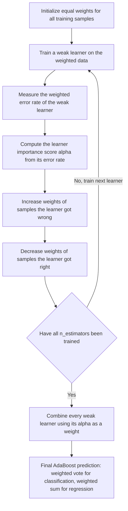
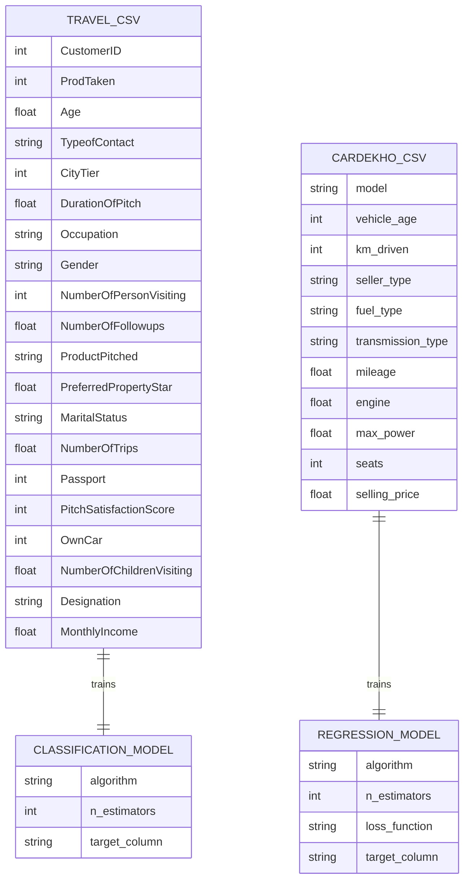
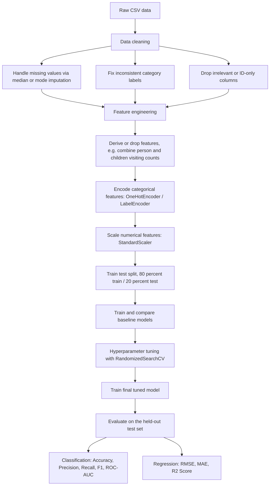

# Adaboost Project

**Classification and Regression using AdaBoost, applied to two real-world business problems: holiday package purchase prediction and used car price prediction.**


---

## Table of Contents

- [Overview](#overview)
- [What is AdaBoost?](#what-is-adaboost)
  - [Ensemble Learning: Bagging vs Boosting](#ensemble-learning-bagging-vs-boosting)
  - [How AdaBoost Works](#how-adaboost-works)
  - [AdaBoost for Classification](#adaboost-for-classification)
  - [AdaBoost for Regression](#adaboost-for-regression)
  - [Advantages and Limitations](#advantages-and-limitations)
- [Repository Structure](#repository-structure)
- [Datasets](#datasets)
  - [Travel Dataset (Holiday Package Purchase Prediction)](#travel-dataset-holiday-package-purchase-prediction)
  - [Cardekho Dataset (Used Car Price Prediction)](#cardekho-dataset-used-car-price-prediction)
- [Project Workflow](#project-workflow)
- [Notebook 1: Holiday Package Prediction (Classification)](#notebook-1-holiday-package-prediction-classification)
- [Notebook 2: Used Car Price Prediction (Regression)](#notebook-2-used-car-price-prediction-regression)
- [Results and Key Observations](#results-and-key-observations)
- [Tech Stack](#tech-stack)
- [Getting Started](#getting-started)
- [Future Improvements](#future-improvements)
- [License](#license)

---

## Overview

This repository is a hands-on implementation of the **AdaBoost (Adaptive Boosting)** algorithm applied to two different types of machine learning problems:

1. **Classification** — predicting whether a customer will purchase a newly launched Wellness Tourism package (`Notebooks/Adaboost_Classification_Implementation.ipynb`).
2. **Regression** — predicting the resale price of a used car (`Notebooks/Adaboost_Regression_Implementation.ipynb`).

Both notebooks follow the same end-to-end machine learning workflow: data cleaning, exploratory analysis, feature engineering, encoding/scaling, baseline model comparison, hyperparameter tuning, and final model evaluation — with AdaBoost as the algorithm of primary interest in both cases, benchmarked against other well-known algorithms.

The goal of this README is twofold: to explain the theory behind AdaBoost from first principles, and to document exactly what was done in each notebook so that the project is understandable to anyone reading it — whether they are new to the repository or revisiting it later.

---

## What is AdaBoost?

### Ensemble Learning: Bagging vs Boosting

AdaBoost belongs to a family of techniques called **ensemble learning**, where multiple "weak" models are combined to build one strong model. There are two dominant strategies for building ensembles:

| Approach | Idea | Example Algorithms |
|---|---|---|
| **Bagging** (Bootstrap Aggregating) | Train many models **independently and in parallel** on random subsets of data, then average/vote their predictions. Reduces variance. | Random Forest |
| **Boosting** | Train models **sequentially**, where each new model tries to correct the mistakes of the previous ones. Reduces bias. | AdaBoost, Gradient Boosting, XGBoost |

AdaBoost was one of the first practical boosting algorithms and remains one of the most widely taught, because its core idea is simple and interpretable: **keep paying more attention to the examples you keep getting wrong.**

### How AdaBoost Works

AdaBoost builds a strong model out of many **weak learners** — typically decision trees with a depth of just 1, called *decision stumps*, which individually perform only slightly better than random guessing. It combines them in the following iterative loop:

1. **Initialize weights** — every training sample starts with an equal weight.
2. **Train a weak learner** on the (weighted) training data.
3. **Evaluate its error** — see which samples it got wrong.
4. **Calculate the learner's importance (`alpha`)** — a learner that performs well gets a higher say in the final decision; a learner close to random guessing gets very little say.
5. **Re-weight the samples** — increase the weight of samples that were misclassified (so the next learner focuses harder on them) and decrease the weight of samples that were correctly predicted.
6. **Repeat** steps 2–5 for a fixed number of estimators (`n_estimators`).
7. **Combine all weak learners** into a single strong model using a weighted vote (classification) or weighted sum (regression), where each learner's vote is scaled by its `alpha`.

This is illustrated below:



Because each learner is trained on a re-weighted version of the data shaped by every learner before it, the learners cannot be trained in parallel — this is the key structural difference from bagging methods like Random Forest.

### AdaBoost for Classification

`AdaBoostClassifier` (used in `Adaboost_Classification_Implementation.ipynb`) supports two boosting algorithms:

- **SAMME** — uses only the predicted class labels from each weak learner.
- **SAMME.R** (the default) — uses predicted class *probabilities*, which usually converges faster and gives better results.

Key hyperparameters tuned in this project:
- `n_estimators` — number of weak learners to sequentially add.
- `algorithm` — `SAMME` or `SAMME.R`.

The final prediction is a **weighted majority vote** across all weak learners.

### AdaBoost for Regression

`AdaBoostRegressor` (used in `Adaboost_Regression_Implementation.ipynb`) follows the same weighted re-sampling idea, but instead of classification error it uses the *residual* (prediction error) to re-weight samples, and it supports different loss functions for computing that weight update:

- `linear` — weight update proportional to the error.
- `square` — weight update proportional to the squared error (penalizes large errors more).
- `exponential` — weight update grows exponentially with error (penalizes large errors the most).

Key hyperparameters tuned in this project:
- `n_estimators` — number of weak learners.
- `loss` — `linear`, `square`, or `exponential`.

The final prediction is a **weighted median/sum** of all weak learners' predictions.

### Advantages and Limitations

**Advantages**
- Simple to implement and reason about; few hyperparameters.
- Often improves accuracy significantly over a single weak learner.
- Less prone to overfitting than many algorithms, since it uses very simple base learners.
- Works for both classification and regression.

**Limitations**
- **Sensitive to noisy data and outliers** — since misclassified/high-error points get up-weighted every round, outliers can dominate later learners.
- **Sequential by nature** — cannot be parallelized across estimators the way bagging methods can, so training can be slower.
- Performance depends heavily on the choice and depth of the weak learner; if the base learner is too weak for a complex, highly non-linear dataset, AdaBoost can underperform more flexible ensembles like Random Forest or Gradient Boosting — a pattern seen in this project's own results (see [Results and Key Observations](#results-and-key-observations)).

---

## Repository Structure

```
Adaboost-Project/
├── Data/
│   ├── Travel.csv                       # Holiday package purchase dataset (classification)
│   └── cardekho_imputated.csv           # Used car listings dataset (regression)
├── Notebooks/
│   ├── Adaboost_Classification_Implementation.ipynb
│   └── Adaboost_Regression_Implementation.ipynb
└── README.md
```

> **Note on file paths:** the classification notebook reads its data with `pd.read_csv("Travel.csv")`, while the regression notebook reads its data with `pd.read_csv("./data/cardekho_imputated.csv")`. Both expect the CSV to be reachable from the notebook's working directory. If you clone this repository and run the notebooks from inside `Notebooks/`, either copy the relevant CSV alongside the notebook, or update the path to `../Data/<filename>.csv`, whichever you prefer to standardize on.

---

## Datasets

### Travel Dataset (Holiday Package Purchase Prediction)

Source: [Holiday Package Purchase Prediction — Kaggle](https://www.kaggle.com/datasets/susant4learning/holiday-package-purchase-prediction)
Size: 4,888 rows × 20 columns.

"Trips & Travel.Com" wants to predict which customers are likely to purchase a newly introduced **Wellness Tourism Package**, so that marketing efforts (which were previously random and expensive) can be targeted efficiently. The target column is `ProdTaken` (1 = purchased, 0 = did not purchase).

| Column | Description |
|---|---|
| `CustomerID` | Unique identifier for the customer (dropped before modeling) |
| `ProdTaken` | **Target.** Whether the customer purchased the package |
| `Age` | Customer's age |
| `TypeofContact` | How the customer was contacted (Self Enquiry / Company Invited) |
| `CityTier` | Tier of the customer's city |
| `DurationOfPitch` | Duration (minutes) of the sales pitch |
| `Occupation` | Customer's occupation |
| `Gender` | Customer's gender |
| `NumberOfPersonVisiting` | Number of people accompanying the customer |
| `NumberOfFollowups` | Number of follow-ups by the salesperson |
| `ProductPitched` | Type of package pitched |
| `PreferredPropertyStar` | Preferred hotel star rating |
| `MaritalStatus` | Customer's marital status |
| `NumberOfTrips` | Average number of trips per year |
| `Passport` | Whether the customer holds a passport |
| `PitchSatisfactionScore` | Customer's satisfaction score for the pitch |
| `OwnCar` | Whether the customer owns a car |
| `NumberOfChildrenVisiting` | Number of children accompanying the customer |
| `Designation` | Customer's job designation |
| `MonthlyIncome` | Customer's monthly income |

### Cardekho Dataset (Used Car Price Prediction)

Source: scraped from CarDekho.com listings.
Size: 15,411 rows × 13 columns.

Predicts the resale (`selling_price`) of a used car based on its specifications, to help sellers price their vehicles competitively based on current market conditions.

| Column | Description |
|---|---|
| `car_name` | Full car name (dropped before modeling) |
| `brand` | Car brand (dropped before modeling) |
| `model` | Car model |
| `vehicle_age` | Age of the vehicle in years |
| `km_driven` | Total kilometers driven |
| `seller_type` | Individual / Dealer / Trustmark Dealer |
| `fuel_type` | Petrol / Diesel / CNG / Electric etc. |
| `transmission_type` | Manual / Automatic |
| `mileage` | Fuel efficiency (km/l) |
| `engine` | Engine displacement (cc) |
| `max_power` | Maximum power output (bhp) |
| `seats` | Number of seats |
| `selling_price` | **Target.** Resale price of the car |

Since both datasets are independent flat files with no shared keys, a strict relational ER diagram doesn't apply — but the diagram below shows each dataset's schema and how it feeds into its corresponding model, which is the closest equivalent for this project:



---

## Project Workflow

Both notebooks follow the same general machine learning pipeline:



---

## Notebook 1: Holiday Package Prediction (Classification)

**File:** `Notebooks/Adaboost_Classification_Implementation.ipynb`

**Step-by-step summary:**

1. **Data loading** — `Travel.csv` loaded into a pandas DataFrame (4,888 rows, 20 columns).
2. **Data cleaning:**
   - Checked and corrected inconsistent category values (e.g., `"Fe Male"` → `"Female"` in `Gender`, `"Single"` → `"Unmarried"` in `MaritalStatus`).
   - Identified columns with missing values and their missing percentage.
   - Imputed missing values: **median** for continuous features (`Age`, `DurationOfPitch`, `NumberOfTrips`, `MonthlyIncome`) and **mode** for discrete/categorical features (`TypeofContact`, `NumberOfFollowups`, `PreferredPropertyStar`, `NumberOfChildrenVisiting`).
   - Dropped `CustomerID` since it carries no predictive information.
3. **Feature engineering:**
   - Combined `NumberOfPersonVisiting` and `NumberOfChildrenVisiting` into a single `TotalVisiting` feature, then dropped the two original columns.
   - Separated features into numerical, categorical, discrete, and continuous groups for analysis.
4. **Encoding and scaling:**
   - Split data into `X` (features) and `y` (`ProdTaken`).
   - Built a `ColumnTransformer` applying `OneHotEncoder(drop='first')` to categorical columns and `StandardScaler()` to numerical columns.
   - Fit the transformer on the training set and applied it to both train and test sets.
5. **Train/test split:** 80/20 split with `random_state=42`.
6. **Baseline model comparison** — trained and evaluated five classifiers with default parameters: Logistic Regression, Decision Tree, Random Forest, Gradient Boosting, and AdaBoost, comparing Accuracy, F1-score, Precision, Recall, and ROC-AUC on both train and test sets.
7. **Hyperparameter tuning** — used `RandomizedSearchCV` (3-fold CV, 100 iterations) to tune Random Forest and AdaBoost:
   ```python
   adaboost_param = {
       "n_estimators": [50, 60, 70, 80, 90],
       "algorithm": ['SAMME', 'SAMME.R']
   }
   ```
8. **Final model training** — retrained Random Forest and AdaBoost with the best-found parameters (`AdaBoostClassifier(n_estimators=80, algorithm='SAMME')`) and re-evaluated on the test set.
9. **ROC-AUC curve** — plotted and saved (`auc.png`) for the final tuned AdaBoost model.

---

## Notebook 2: Used Car Price Prediction (Regression)

**File:** `Notebooks/Adaboost_Regression_Implementation.ipynb`

**Step-by-step summary:**

1. **Data loading** — `cardekho_imputated.csv` loaded into a pandas DataFrame (15,411 rows, 13 columns).
2. **Data cleaning:**
   - Checked for missing values.
   - Dropped `car_name` and `brand`, since `model` already captures the identifying information needed for prediction.
3. **Feature categorization** — split columns into numerical and categorical, and further into discrete vs. continuous, to understand the dataset's structure.
4. **Encoding and scaling:**
   - Split data into `X` (features) and `y` (`selling_price`).
   - Applied `LabelEncoder` to the high-cardinality `model` column (many unique car models).
   - Built a `ColumnTransformer` applying `OneHotEncoder(drop='first')` to the low-cardinality categorical columns (`seller_type`, `fuel_type`, `transmission_type`) and `StandardScaler()` to numerical columns, with `remainder='passthrough'` for the rest.
5. **Train/test split:** 80/20 split with `random_state=42`.
6. **Baseline model comparison** — trained and evaluated seven regressors with default parameters: Linear Regression, Lasso, Ridge, K-Neighbors Regressor, Decision Tree, Random Forest, and AdaBoost, comparing RMSE, MAE, and R² Score on both train and test sets.
7. **Hyperparameter tuning** — used `RandomizedSearchCV` (3-fold CV, 100 iterations) to tune KNN, Random Forest, and AdaBoost:
   ```python
   ada_params = {
       "n_estimators": [50, 60, 70, 80],
       "loss": ['linear', 'square', 'exponential']
   }
   ```
8. **Final model training** — retrained Random Forest, KNN, and AdaBoost with the best-found parameters (`AdaBoostRegressor(n_estimators=60, loss='linear')`) and re-evaluated on the test set.

---

## Results and Key Observations

### Classification — Baseline Models (Test Set)

| Model | Accuracy | F1 Score | Precision | Recall | ROC-AUC |
|---|---|---|---|---|---|
| Logistic Regression | 0.8354 | 0.8078 | 0.6829 | 0.2932 | 0.6301 |
| Decision Tree | 0.9192 | 0.9183 | 0.8111 | 0.7644 | 0.8606 |
| **Random Forest** | **0.9315** | **0.9265** | 0.9697 | 0.6702 | 0.8325 |
| Gradient Boosting | 0.8589 | 0.8398 | 0.7732 | 0.3927 | 0.6824 |
| AdaBoost | 0.8354 | 0.8115 | 0.6630 | 0.3194 | 0.6400 |

### Classification — After Hyperparameter Tuning (Test Set)

| Model | Best Parameters | Accuracy | F1 Score | Precision | Recall | ROC-AUC |
|---|---|---|---|---|---|---|
| Random Forest | `n_estimators=1000, max_depth=None, max_features=7, min_samples_split=2` | 0.9356 | 0.9313 | 0.9706 | 0.6911 | 0.8430 |
| AdaBoost | `n_estimators=80, algorithm='SAMME'` | 0.8364 | 0.7977 | 0.7818 | 0.2251 | 0.6049 |

### Regression — Baseline Models (Test Set)

| Model | RMSE | MAE | R² Score |
|---|---|---|---|
| Linear Regression | 502,543.59 | 279,618.58 | 0.6645 |
| Lasso | 502,542.67 | 279,614.75 | 0.6645 |
| Ridge | 502,533.82 | 279,557.22 | 0.6645 |
| K-Neighbors Regressor | 253,118.42 | 112,704.35 | 0.9149 |
| Decision Tree | 305,593.06 | 124,819.35 | 0.8759 |
| **Random Forest** | **227,094.93** | **102,202.38** | **0.9315** |
| AdaBoost | 452,194.97 | 297,953.03 | 0.7284 |

### Regression — After Hyperparameter Tuning (Test Set)

| Model | Best Parameters | RMSE | MAE | R² Score |
|---|---|---|---|---|
| Random Forest | `n_estimators=100, max_depth=None, max_features='auto', min_samples_split=2` | 230,608.25 | 102,247.42 | 0.9294 |
| K-Neighbors Regressor | `n_neighbors=10` | 263,872.06 | 117,483.04 | 0.9075 |
| AdaBoost | `n_estimators=60, loss='linear'` | 530,557.96 | 361,436.48 | 0.6261 |

### Key Observations

- **AdaBoost was outperformed by Random Forest in both tasks.** This is a common and expected pattern: AdaBoost's weak learners are shallow decision trees (near decision stumps), which struggle to capture the complex, non-linear feature interactions present in both datasets, while Random Forest aggregates many deeper, independently-trained trees.
- **Hyperparameter tuning did not meaningfully improve AdaBoost in this project** — in fact, test performance dropped slightly after tuning for classification (Recall fell from 0.32 to 0.23), suggesting the parameter search space (`n_estimators`, `algorithm`/`loss`) was too narrow to move the needle without also varying the base estimator's depth.
- **Class imbalance** in the `ProdTaken` target (only ~18% of customers purchased historically) likely limited Recall across all classifiers, but especially for AdaBoost and Logistic Regression, which are more sensitive to imbalance than tree ensembles.
- **For the regression task**, the wide, right-skewed range of `selling_price` combined with AdaBoost's shallow base learner limited its ability to model price non-linearly across car segments — visible in its comparatively high RMSE/MAE even after tuning.
- Despite not being the top performer here, AdaBoost remains a valuable, low-variance baseline that is fast to train and easy to interpret — useful as a benchmark against more complex ensembles.

---

## Tech Stack

| Category | Tools / Libraries |
|---|---|
| Language | Python 3 |
| Data handling | pandas, numpy |
| Visualization | matplotlib, seaborn, plotly |
| Machine learning | scikit-learn (`AdaBoostClassifier`, `AdaBoostRegressor`, `RandomForestClassifier/Regressor`, `DecisionTreeClassifier/Regressor`, `LogisticRegression`, `GradientBoostingClassifier`, `KNeighborsRegressor`, `Lasso`, `Ridge`) |
| Model selection | `train_test_split`, `RandomizedSearchCV` |
| Environment | Jupyter Notebook |

---

## Getting Started

1. **Clone the repository**
   ```bash
   git clone <repository-url>
   cd Adaboost-Project
   ```

2. **Create a virtual environment (recommended)**
   ```bash
   python -m venv venv
   source venv/bin/activate      # On Windows: venv\Scripts\activate
   ```

3. **Install dependencies**
   ```bash
   pip install pandas numpy matplotlib seaborn plotly scikit-learn jupyter
   ```

4. **Launch Jupyter and open a notebook**
   ```bash
   jupyter notebook Notebooks/Adaboost_Classification_Implementation.ipynb
   ```

5. **Check data paths** before running — see the [note in Repository Structure](#repository-structure) about how each notebook expects to find its CSV file.

---

## Future Improvements

- Address class imbalance in the classification task (e.g., SMOTE, class weighting) to improve Recall.
- Benchmark against modern boosting libraries (XGBoost, LightGBM, CatBoost) alongside AdaBoost.
- Use `GridSearchCV`/`RandomizedSearchCV` on the AdaBoost **base estimator's** depth, not just `n_estimators` and `algorithm`/`loss`.
- Apply feature importance / SHAP analysis to explain predictions.
- Replace the single train/test split with k-fold cross-validation for more robust performance estimates.
- Treat outliers and apply a log-transform to `selling_price` before regression to reduce the influence of very high-priced cars.
- Package the final models behind a simple API (Flask/FastAPI) for real-time inference.

---

## License

This project is provided as-is for educational and portfolio purposes. Add your preferred license (e.g., MIT) here if you intend to distribute this repository publicly.
